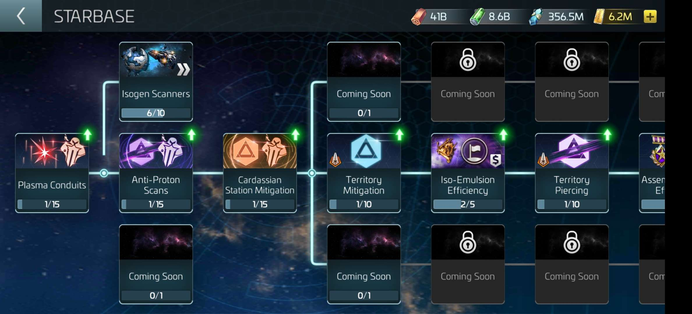
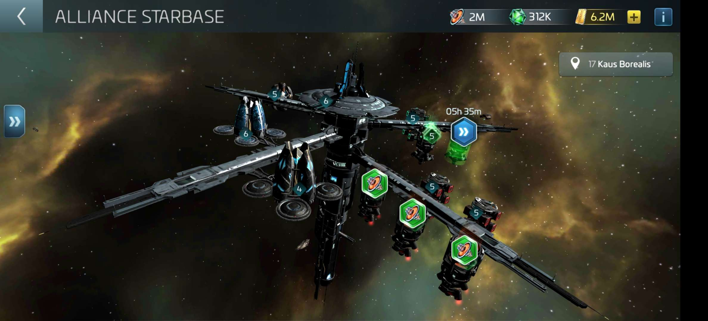
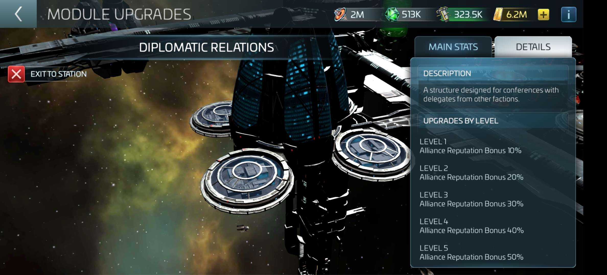
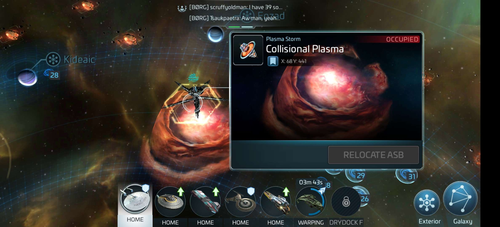
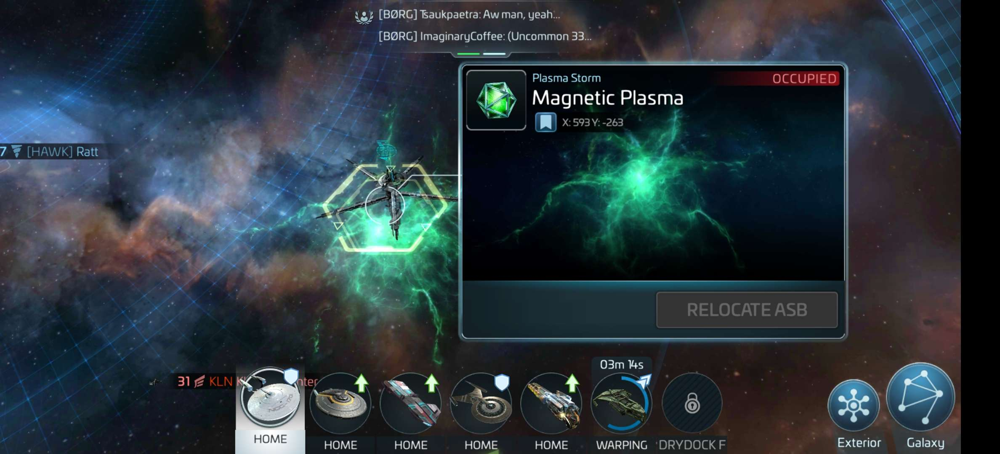

__Alliance Starbase (ASB) Game Loop__
- Use regular Armada Directives to run **Cardassian Armadas** in **Cardassian Space**
- Defeat Uncommon/Rare/Epic **Cardassian Armadas** to earn **Alliance Points** and either **Cardassian Loot** (Uncommons) or **Superior Cardassian Loot** (Rares/Epics)
- Spend **Cardassian Loot** and **Superior Cardassian Loot** in the Alliance Store to pull **Resistance Bounties**, **Alliance Altruism**, and **Maquis Bounties** Armada Chests (daily):
    - **Resistance Bounties** - Costs **Cardassian Loot**. Gives "a little of everything". 
    - **Alliance Altruism** - Costs **Superior Cardassian Loot**. Gives the most for the **Alliance Starbase** but gives the least for your Starbase research.
    - **Maquis Bounties** - Costs **Superior Cardassian Loot**. Gives "a lot of everything".
- Pull **Resistance Bounties**, **Alliance Altruism**, and **Maquis Bounties** Armada Chests to collect new materials and reputation:
    - **Assembly Medals** - Starbase research in the new **Starbase Research Tree** (analogous to Iso-emulsion)
    - **Alliance Points** (**Alliance Reputation**) - Progression requirement for higher level Starbase research (analogous to Rogue Reputation).
    - **Subspace Superconductors** - Upgrade **Alliance Starbase** modules. Automatically donated to the Alliance Inventory
    - **Alliance Speedups** - Speed-up **Alliance Starbase** module upgrades. Automatically donated to the Alliance Inventory
    - **Alliance Reserves** - Relocate **Alliance Starbase**. Automatically donated to the Alliance Inventory

  
  
  
  
  

__Cardassian Armadas__
- The **Cardassian Loot** and **Superior Cardassian Loot** rewards scale based on armada level and armada rarity. However, the **Alliance Point** rewards only scale based on armada rarity:
    - Uncommon **Cardassian Armadas** reward **Cardassian Loot** and `5K` **Alliance Points** 
    - Rare **Cardassian Armadas** reward **Superior Cardassian Loot** and `15K` **Alliance Points** 
    - Epic **Cardassian Armadas** reward **Superior Cardassian Loot** and `25K` **Alliance Points**
- Cardassian armadas have high base critical chance and deal high critical damage:
    - `20%` base Critical Chance
    - `300%` / `375%` / `450%` Critical Damage for Uncommon / Rare / Epic respectively
    - Uncommons increase their own Critical Chance by `10%` every round (`100%` by round 9)
- Uncommon Armada Crews:
    - Everyone should crew to maximize `Gaila`'s critical damage reduction
    - `Picard`,`Beverly`,`Gaila`
    - `Pike`,`Moreau`,`Gaila`
- Rare/Epic Armada Crews:
    - Useful to reduce the Armada's critical chance or critical damage
    - `Deanna Troy`, `Beverly`, `Picard` (only 1 ship)
    - `Gaila` as a bridge officer
    
  
  
  
  
  

__Starbase Research__
- Spend **Assembly Medals** on Starbase research from the new **Starbase Research Tree**
- Higher level Starbase research requires higher level **Alliance Starbase** modules and higher **Alliance Reputation**
- Complete Level 1 of all Starbase research nodes to receive the largest bonuses before researching higher levels
    - Level 1 of most Starbase research nodes provides a large bonus with subsequent levels providing smaller improvements
- Starbase research only applies to yourself (not the alliance) and is permanent (research/bonuses are _not_ lost if you leave an alliance) 

  
  
  

__Alliance Starbase (ASB)__
- Alliance owned Station that provides buffs to all alliance members using materials donated by members:
    - Only Admiral/Commodores can relocate the ASB or build ASB modules
- Certain ASB modules provide buffs for alliance members:
    - _Tactical Deck_ - Increases damage against **Cardassian Armadas**
    - _Diplomatic Relations_ - Increases **Alliance Points** gained
- Other ASB modules improve the ASB's ability to reach, harvest and store **Plasma** from **Plasma Storms**:
    - _Collisional Plasma Harvesters_ - Increase **Collisional Plasma** harvesting rate from **Collisional Plasma Storms**. Must periodically be collected manually (analogous to player station resource generators)
    - _Collisional Plasma Vaults_ - Increase **Collisional Plasma** vault protection (analogous to player station resource vaults)
    - _Magnetic Plasma Harvesters_ - Increase **Magnetic Plasma** harvesting rate from **Magnetic Plasma Storms**. Must periodically be collected manually
    - _Magnetic Plasma Vaults_ - Increase **Magnetic Plasma** vault protection
    - _Plasma Processor_ - Increase **Collisional Plasma** and **Magnetic Plasma** storage capacity. Increase the amount of **Plasma** that can be harvested from a **Plasma Storm** before the ASB must be relocated.
    - _Assembly Chambers_ - Increase ASB relocation range (analogous to player station Operations building)
- Spend **Subspace Superconductors**, **Collisional Plasma**, and **Magnetic Plasma** to upgrade ASB modules:
    - Collect **Subspace Superconductors** by pulling **Resistance Bounties**, **Alliance Altruism**, and **Maquis Bounties** Armada Chests from the Alliance Store
    - Spend **Alliance Reserves** to relocate the ASB to available **Collisional Plasma Storms** and **Magnetic Plasma Storms** for harvesting.
    - The ASB can only collect a fixed amount of **Plasma**, determined by the _Plasma Processor_ module, from a **Plasma Storm** before it must be relocated.

  
  
  
  
  
  
__Plasma Storm Locations__
- **Collisional Plasma Storms**
    - Level 16: Bharani, Eizeb, Jishui, Kaus Australis, Ora Leraa, Pune
    - Level 17: Aciben, Freyda, Kaus Borealis, Kaus Media, Oltomon, Vemet
    - Level 18: Bubeau, Dalukerinborva, Helvetios, Skyedark, Todem, Wezen
    - Level 19: Eisenhorn, Gelvin, Kosz, Wasat, Zeta Polis, Zhang
    - Level 21: Baryn, BeK, Le'Onor, Llorrac, Lo'Uren, Mada
    - Level 22: Dauouuy, Iocau, Jonauer, Rosec, Woxoxit, Zadiaoo
    - Level 23: Foaiveb, Godui, Gowok, Posel, Tufem, Uikuv
- **Magnetic Plasma Storms**
    - Level 29: Morska, P'Jem, Rator
    - Level 30: Ascher, Doloran, Elequa, Emie, Galorndon Core, H'Atoria, Jaq, Lloyd, Noakyn, Nurnias, Parka, Sahqooq
    - Level 31: Barklay, Ebisu, Inari, Lempo, Lipig, May'lang, Robeton, Sinisser, Tandorian, Tullias, Ulrich
    - Level 32: Izanagi
    - Level 33: Aiti, Ferrer, Kaisu, Kavka, Pekka
    - Level 34: Tau Ceti
    - Level 35: Argentomea, Siiolux

__References__
- https://scopely.helpshift.com/hc/en/19-star-trek-fleet-command/faq/6917-alliance-starbase/
- https://www.youtube.com/watch?v=utiwKniMSXw&t=119s
- https://www.youtube.com/watch?v=6VYEnD782lo
- https://www.youtube.com/watch?v=7L2wifaLrOU
- https://stfc.space/buildings?f=$name=%26s=2%26page:1&s=$ascending:true%26sortBy:0
