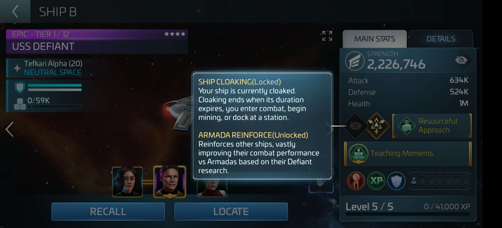

__Bajoran Faction Game Loop__
- Open the daily **Defiant Amplified Claim** bundle for free from the **Bajoran Faction Store** to collect **Bajoran Badges** and **Bajoran Credits**
- Grind **Jem'Hadar** hostiles in **Dominion Space** (Northwest of Federation space) to collect **Antimatter Units**
- Spend **Antimatter Units** in the **Bajoran Faction Store** to collect more **Bajoran Badges** from the **Hostile Exchange** bundle
- Spend **Bajoran Badges** in the **Bajoran Faction Store** to collect other currencies from various bundles:
    - **Bajoran Reputation** - Increases your **Bajoran Faction Reputation** level (daily **Reputation Advancement** bundle)
    - Uncommon **Dominion Solo Armada Directives** - Start Uncommon **Dominion Solo Armadas** (daily **Directive Exchange** bundle, `100` directives). 
    - **Bajoran Credits** - Purchase other materials and buffs in the **Bajoran Faction Store**.
- Spend **Bajoran Credits** in the **Bajoran Faction Store** to collect:
    - **Ablative Armor Parts** - **Defiant** ship component upgrades
    - **Subspace Transceivers** - **Defiant** research in the _Starships_ research tree
    - **Bajoran Favors** - Significant bonuses to various gameplay aspects (economy, combat, officers, etc)

  
  
  

__Dominion Solo Armadas__
- **Dominion Solo Armadas** require sending 3 of your own ships to attack a Dominion armada.
- Use **Dominion Solo Armada Directives** to run **Dominion Solo Armadas** in **Dominion Space**
    - Armada targets immediately repair all hull damage after an unsuccessful attempt
- Defeat Uncommon/Rare/Epic **Dominion Solo Armadas** to earn Uncommon/Rare/Epic **Dominion Solo Armada Credits** and **Dominion Solo Armada Edicts**
    - Higher level and higher rarity armadas reward more **Dominion Solo Armada Edicts**
- Spend **Dominion Solo Armada Credits** and **Dominion Solo Armada Edicts** in the **Bajoran Faction Store** to pull armada chests giving unique rewards:
    - **Bajoran Credits**
    - Uncommon/Rare/Epic **Dominion Solo Armada Directives**
    - DS9 Officer Shards - `Changeling Kira`, `Miles O'Brian`, `Benjamin Sisko`
    - **Diplomacy Tokens** - Purchase other materials in the **Bajoran Faction Store**
- **Dominion Solo Armadas** are typically short duration and do not deal significant critical damage so player ship crews should focus on maximizing damage mitigation and critical hit chance. Examples:
    - `5 of 11`, `6 of 11`, `Khan`
    - `Sisko`, `O'Brian`, `Bashir` 
    - `Picard`, `Beverly`, `Lorca`
- To maximize armada rewards use the **Defiant** and greedy crews, however the risk of failure with greedy crews is increased. Examples:
    - `5 of 11`, `6 of 11`, any officer
    - `Geordi`, synergy officer, `5 of 11`

  
  
  
  
  
  

__Defiant Ship Usage__
- Armadas - Special active ability **Armada Reinforce** costs **Ablative Amplifiers** to _buff_ player ships against armadas based on **Defiant Research**.
    - Pull **Ablative Amplifiers** daily from the **Bajoran Faction Store** in exchange for **Bajoran Credits**
    - Buff cost and duration improve with ship level
- Improves daily **Bajoran Badges** and **Bajoran Credits** bundle by `35-65%` (scales with ship tier)
- When participating in a **Dominion Solo Armadas**, increases the amount of **Dominion Solo Armada Edict** rewards
- Free **Defiant Weaponry** **Bajoran Favor** in the **Bajoran Faction Store** which increases the damage and reload chance of the **Defiant** against solo armadas (additional favor at each ship tier)
- Obtain **Defiant** blueprints from the **Bajoran Faction Store** starting at _Militia_ reputation level.
- Requires _Shipyard_ level 35

  
  

__Defiant Research__
- Spend **Subspace Transceivers** from the **Bajoran Faction Store** on **Defiant Research** nodes in the _Starships_ research tree to increase the potency of the **Defiant's** active **Armada Reinforce** ability
- Complete Level 1 of each Defiant Research node in the `Army Of One` (top-most) and `Valiant Camaraderie` (middle) branches to receive the largest initial bonuses before researching higher levels.
    - For most Defiant Research nodes, level 1 grants a large bonus with subsequent levels granting smaller bonuses

  

__References__
* https://www.startrekfleetcommand.com/2022/10/04/update-47-deep-space-nine-pt-2/
* https://scopely.helpshift.com/hc/en/19-star-trek-fleet-command/faq/6980-bajoran/
* https://www.startrekfleetcommand.com/2022/11/08/update-48-patch-notes/
* https://scopely.helpshift.com/hc/en/19-star-trek-fleet-command/faq/7037-uss-defiant/
