__Overview__

- **Vidar** ship unlocks the Borg game loop and **Borg Refinery**:
    - Requires _Shipyard_ level 25
    - `+35000%` damage against Borg
    - Fast `120` impulse speed
    - Large cargo hold
- **Borg Refinery** provides various faction, officer, travel token, and **Fleet Commander** materials:
    - Refinery bundles scale-up with the tier of your **Vidar** or **Vidar Talios** once built
    - Primary sourcing for **Fleet Commander** materials
- **Vidar Talios** ship:
    - Requires _Shipyard_ level 35
    - Requires Tier 9 **Vidar**
    - Blueprints obtained for free by completing the two free mission chains from the _Assimilated_ arc in the Holodeck (requires Tier 9 **Vidar**)
    - Enhances the **Borg Refinery**
- Borg Armadas:
    - **Regular Borg Armadas** (only for events)
    - **Megacube Armadas** (only for events)
    - **Borg Solo Armadas**
    - **Expansion Cube Armadas**

__Primary Game Loop__

- Collect `2` free **Transwarp Cells** from the _Gifts_ tab daily (requires **Vidar**)
- Use **Transwarp Cells** to enter **Borg Tactical Probe** systems surrounding:
    - Alta (25)
    - Pasadoran (26-27)
    - Panak (28-29)
    - Unoma (31-33)
    - Idola (36-44)
    - Retha (46-58)
- Grind **Borg Tactical Probe** hostiles to farm **Inert Nanoprobes** (very rare **Assimilated Ferengi Trader** hostiles drop **Latinum Antiques**)
    - **Vidar** for level 33- probes
    - **Vidar Talios** for level 36+ probes
    - Optimal Crew: `SNW Pike`, `SNW Uhura`, `SNW La'an`
    - Alternative crews depend on target probe level
        - `1 of 11`, `Beverly`, `5 of 11`
        - `7 of 11`, `5 of 11`, `9 of 11`
        - `5 of 11`, `Chen`, `T'laan`
        - `Pike`, `Moreau`, `Chen`
        - `Pike`, `Moreau`, `T'laan`
- Spend **Inert Nanoprobes** in the **Borg Refinery** to pull:
    - **Active Nanoprobes** (daily) - Promote borg officers
    - **Charged Nanoprobes** (daily)
- Spend **Charged Nanoprobes** to upgrade the **Vidar**/**Vidar Talios** ship components
- Spend **Charged Nanoprobes** in the **Borg Refinery** to pull other bundles:
    - Fed/Kln/Rom/Ind Faction Credits (daily)
    - Fed/Kln/Rom Faction Reputation (daily)
    - Uncommon **Borg Solo Armada** Directives (daily) - Start Uncommon **Borg Solo Armadas**
- Spend **Latinum Antiques** in the **Borg Refinery** to receive: 
    - Resource Tokens
    - Ship XP
    - **Transwarp Cells**
    - **Lucrative Transwarp Cells**
    - Unc/Rare/Epic **Latinum Transwarp Cells** (no longer useful)
- Spend **Lucrative G3 Transwarp Cells** to visit large-node, high-speed G3 material mining systems:
    - Mira - G3 Gas
    - Forin - G3 Ore
    - Perek - G3 Crystal

  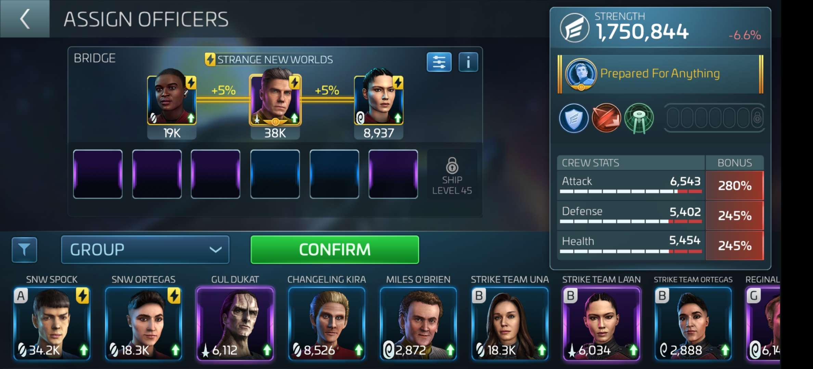
  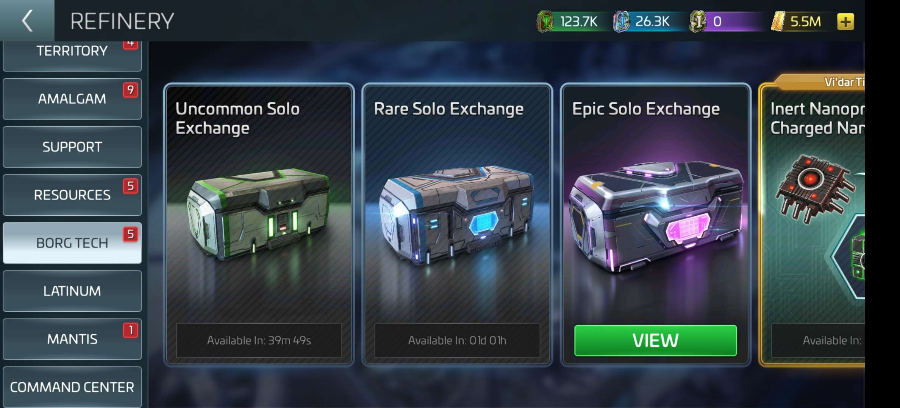
  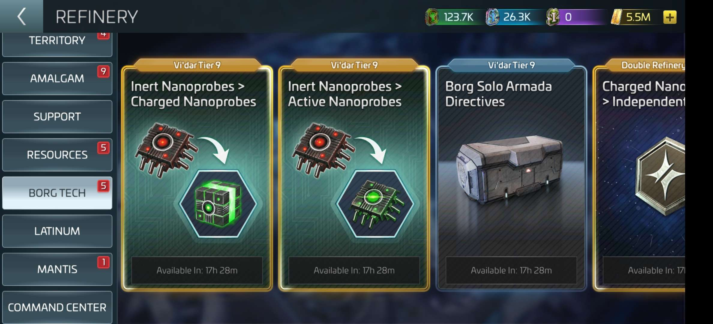
  
  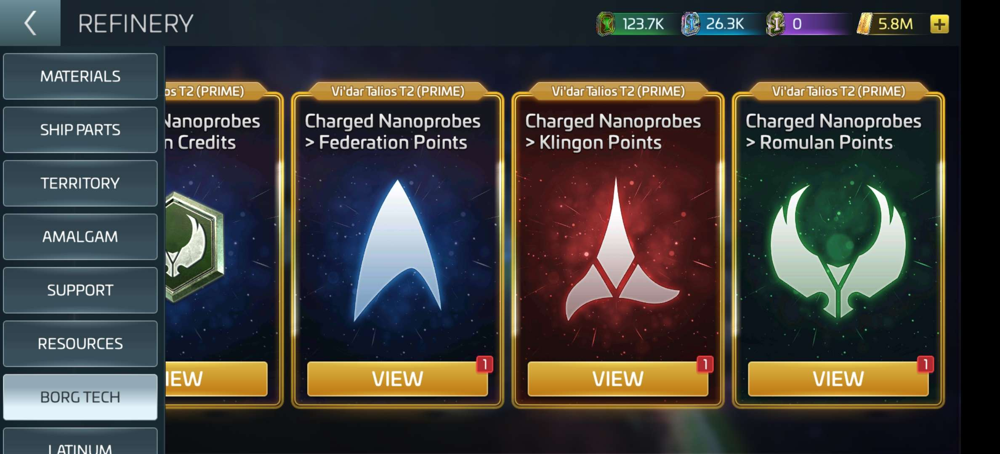
  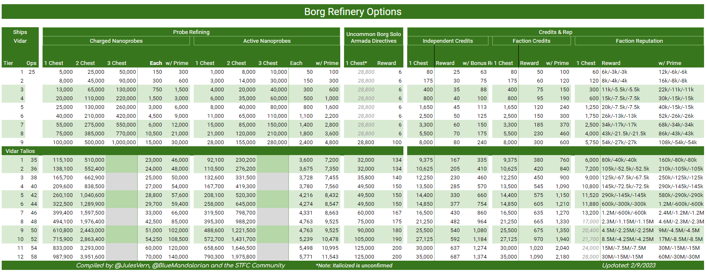

__Borg Solo Armadas__
- **Borg Solo Armadas** require sending 3 of your own ships to attack a Borg Sphere armada.
    - Armada targets immediately repair all hull damage after an unsuccessful attempt
- Complete 4 **Translink Disruptor** research nodes in the _Combat_ research tree to boost damage against **Borg Solo Armadas**
    - `+35000%` damage dealt with faction ships and the ISS Jellyfish
    - **Federation Translink Disruptor**
    - **Klingon Translink Disruptor**
    - **Romulan Translink Disruptor**
    - **Jellyfish Translink Disruptor**
- Use **Borg Solo Armada Directives** to run **Borg Solo Armadas** in dedicated **Borg Solo Armada** systems (denoted by green clouds on the Galaxy Map):
    - Atraxi
    - Megnomis
    - Petoran
    - Efros
    - Torovin
    - Thora-Beta-6
    - Thora-Omega-2
    - Orin-Theta-12
    - Orin-Sigma-9
- Defeat Uncommon/Rare/Epic **Borg Solo Armadas** to earn Uncommon/Rare/Epic **Borg Solo Armada Credits** and **Expansion Cube Armada Directives**
- Spend **Borg Solo Armada Credits** in the **Borg Refinery** to pull 3-day Uncommon/Rare/Epic armada chests containing unique rewards:
    - Rare/Epic **Borg Solo Armada Directives**
    - **`+X%` Vidar Loot** Exocomps
    - Borg Officers - ???
    - **Fleet Commander** materials

  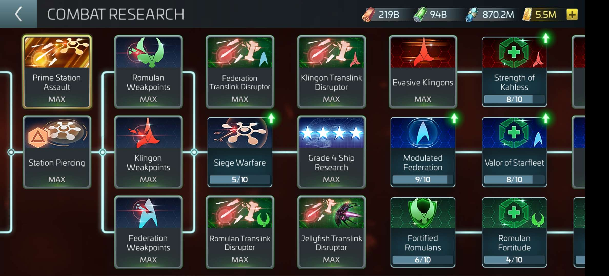    
  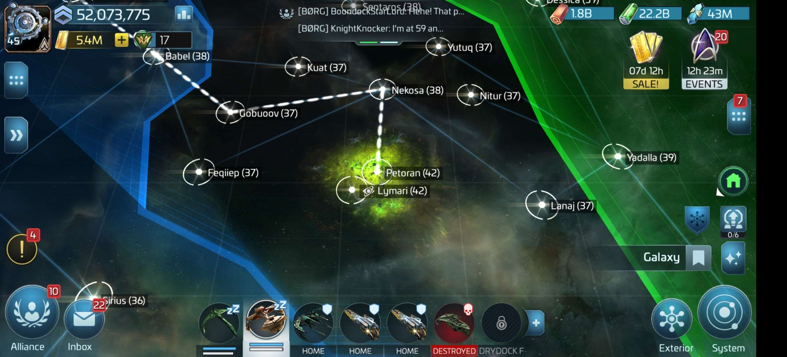
  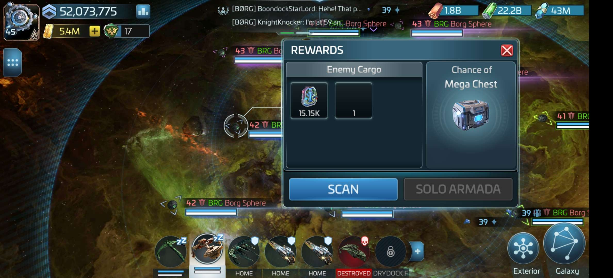 
  
  
  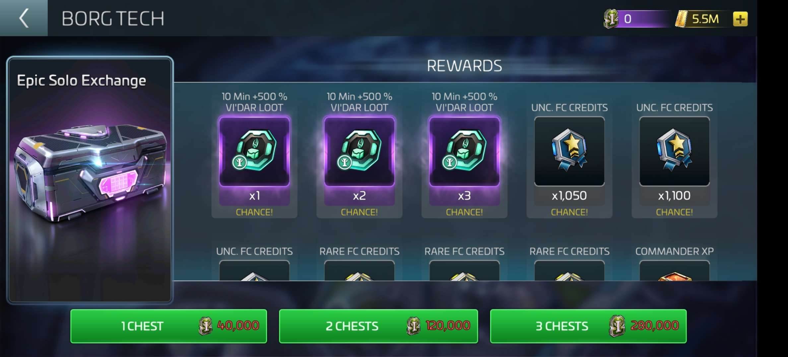

__Expansion Cube Armadas__
- Located in systems branching off of **Borg Solo Armada** systems
- Requires **Vidar Talios**
- Requires **Foreknowledge** buff for all **Vidar Talios's**
    - Aquire by defeating any **Borg Solo Armada** (your **Vidar Talios** does _not_ have to participate)
    - **Foreknowledge** is automatically applied to your **Vidar Talios** 
    - `1` hour duration
- Requires coordinated crews
- - Defeat **Expansion Cube Armadas** to earn **Vinculum Fragments**
- Spend **Vinculum Fragments** in the **Borg Refinery** to pull 3-day **Expansion Cube Exchange** armada chests containing:
    - Charged Nanoprobes and Active Nanoprobes
    - Borg Officer Shards - `Dezoc`, `Borg Queen`
    - Unc/Rare/Epic **Borg Solo Armada Directives**
    - **`+100%` Vidar Talios Loot** Exocomps

  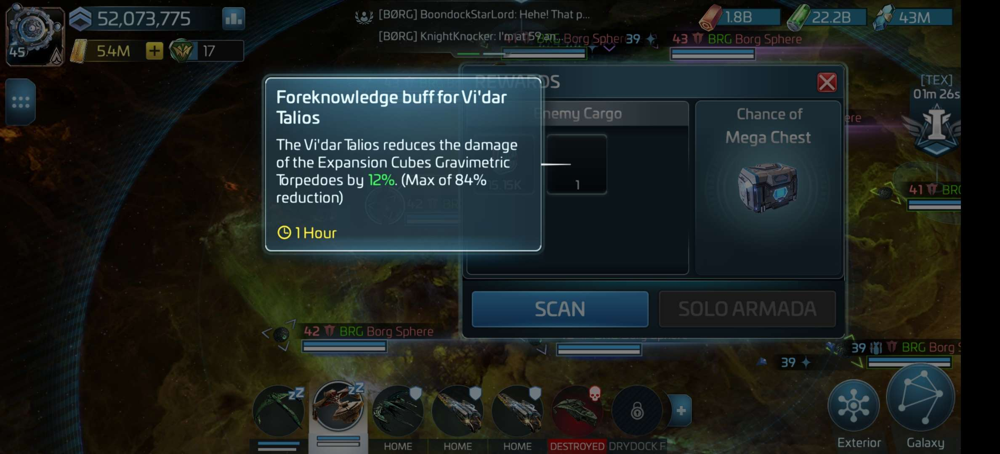
  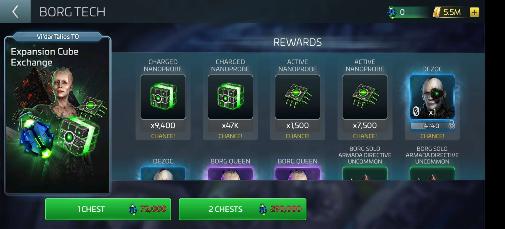

__Regular Borg Armadas__
- Requires Vidars or Talios
- Borg directive sourcing does not exist

__Megacube Armadas__
- Megacube directive sourcing does not exist
- Types:
    - Tractor Beam = Explorer
    - Photon Cannon = Interceptor
    - Disruptor = Battleship (easiest)
- Requires Vidars or Talios
- Requires coordinated crews:
    - Weakest Ship (Anti-Critical) =  9, 7, 5 (or any 9 + max synergy)
    - Strongest Ship (Hull Breach) = 5, 6, Lorca
    - Other Ships (Critical) = 5, 6, Khan 