__Overview__

- **Vidar** G3 ship unlocks the Borg game loop and **Borg Refinery**:
    - Requires _Shipyard_ level 25
    - `+35000%` damage against Borg
    - Fast `120` impulse speed
    - Large cargo hold
    - Used to grind level 33- **Borg Tactical Probe** hostiles
- **Borg Tactical Probe** Systems
- **Borg Refinery** provides faction reputation, faction credits, officer shards, travel tokens, and **Fleet Commander** materials:
    - Refinery bundles scale-up with the tier of your **Vidar** or **Vidar Talios** once built
    - Primary sourcing for **Fleet Commander** materials
- **Vidar Talios** G4 ship:
    - Requires _Shipyard_ level 35
    - Requires Tier 9 **Vidar**
    - Blueprints obtained for free by completing the two free mission chains from the _Assimilated_ arc in the Holodeck (requires Tier 9 **Vidar**)
    - Enhances the **Borg Refinery**
    - "A stronger Vidar" (increased damage against borg, faster, larger cargo hold)
    - Used to grind level 36+ **Borg Tactical Probe** hostiles and **Expansion Cube Armadas** 
- Borg Armadas:
    - **Regular Borg Armadas** - only for events
    - **Megacube Armadas** - only for events
    - **Borg Solo Armadas** - **Borg Refinery** bundles
    - **Expansion Cube Armadas** - **Borg Refinery** bundles

  <!-- 
  
  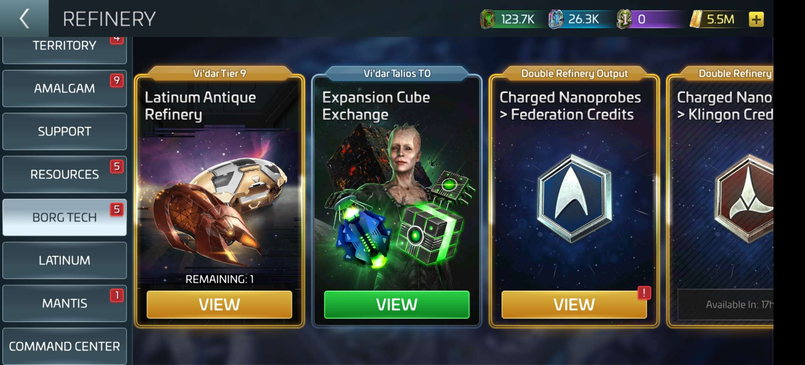
   -->
  

__Borg Game Loop__

- Collect `2` free **Transwarp Cells** from the _Gifts_ tab daily (requires **Vidar**)
- Use **Transwarp Cells** to enter **Borg Tactical Probe** systems surrounding:
    - Alta (25)
    - Pasadoran (26-27)
    - Panak (28-29)
    - Unoma (31-33)
    - Idola (36-44)
    - Retha (46-58)
- Grind **Borg Tactical Probe** hostiles to farm **Inert Nanoprobes** (very rare **Assimilated Ferengi Trader** hostiles drop **Latinum Antiques**)
    - **Vidar** for level 33- probes
    - **Vidar Talios** for level 36+ probes
    - Optimal Crew: `SNW Pike`, `SNW Uhura`, `SNW La'an`
    - Alternative Crews:
        - `1 of 11`, `Beverly`, `5 of 11`
        - `7 of 11`, `5 of 11`, `9 of 11`
        - `5 of 11`, `Chen`, `T'laan`
        - `Pike`, `Moreau`, `Chen`
        - `Pike`, `Moreau`, `T'laan`
- Spend **Inert Nanoprobes** in the **Borg Refinery** to pull:
    - **Active Nanoprobes** (daily) - Promote borg officers
    - **Charged Nanoprobes** (daily)
- Spend **Charged Nanoprobes** to upgrade **Vidar** / **Vidar Talios** ship components and in the **Borg Refinery** to pull other bundles:
    - Fed/Kln/Rom/Ind Faction Credits (daily)
    - Fed/Kln/Rom Faction Reputation (daily)
    - Uncommon **Borg Solo Armada Directives** (daily) - Start Uncommon **Borg Solo Armadas**
- Spend Uncommon/Rare/Epic **Borg Solo Armada Directives** to start Uncommon/Rare/Epic **Borg Solo Armadas** in dedicated **Borg Solo Armada** systems :
    - Atraxi
    - Megnomis
    - Petoran
    - Efros
    - Torovin
    - Thora-Beta-6
    - Thora-Omega-2
    - Orin-Theta-12
    - Orin-Sigma-9
- Defeat Uncommon/Rare/Epic **Borg Solo Armadas** to earn Uncommon/Rare/Epic **Borg Solo Armada Credits** and **Expansion Cube Armada Directives**
- Spend Uncommon/Rare/Epic **Borg Solo Armada Credits** in the **Borg Refinery** to pull Uncommon/Rare/Epic **Solo Exchange** armada chests (3-day) containing:
    - Rare **Borg Solo Armada Directives** (Uncommon **Solo Exchange** chests)
    - Epic **Borg Solo Armada Directives** (Rare **Solo Exchange** chests)
    - **`+X%` Vidar Loot** Exocomps
    - Borg Officer Shards - All `n of 11` officers, `Ghalenar`, `Hugh`
    - **Fleet Commander** materials
- Spend **Expansion Cube Directives** to start **Expansion Cube Armadas** in systems branching off from **Borg Solo Armada** systems:
    - Toz Raghli
    - Lymari
    - Lomosi
    - Kej Bal
    - Eabha
- Defeat **Expansion Cube Armadas** to earn **Vinculum Fragments**
- Spend **Vinculum Fragments** in the **Borg Refinery** to pull **Expansion Cube Exchange** armada chests (3-day) containing:
    - Borg Officer Shards - `Dezoc`, `Borg Queen`
    - **`+X%` Vidar Talios Loot** Exocomps
    - Uncommon/Rare/Epic **Borg Solo Armada Directives**
    - **Active Nanoprobes**
    - **Charged Nanoprobes** 
- Spend **Latinum Antiques** in the **Borg Refinery** to receive: 
    - Resource Tokens
    - Ship XP
    - **Transwarp Cells**
    - **Lucrative Transwarp Cells**
    - Unc/Rare/Epic **Latinum Transwarp Cells** (no longer useful)
- Spend **Lucrative G3 Transwarp Cells** to visit large-node, high-speed G3 material mining systems:
    - **Mira System** - G3 Gas
    - **Forin System** - G3 Ore
    - **Perek System** - G3 Crystal

  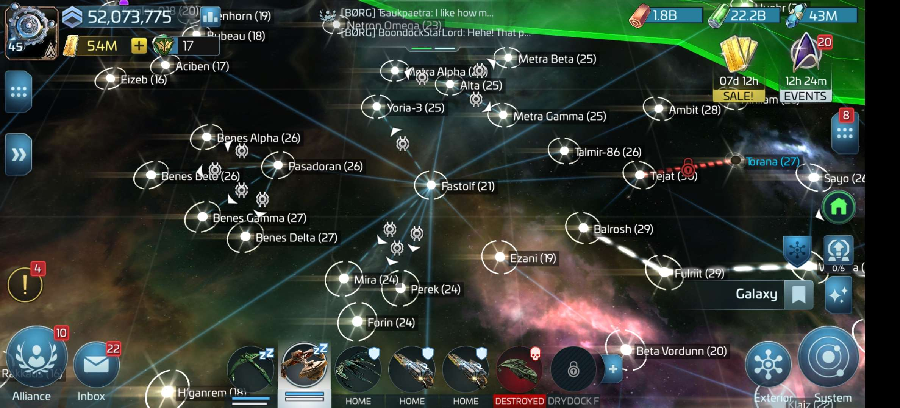
  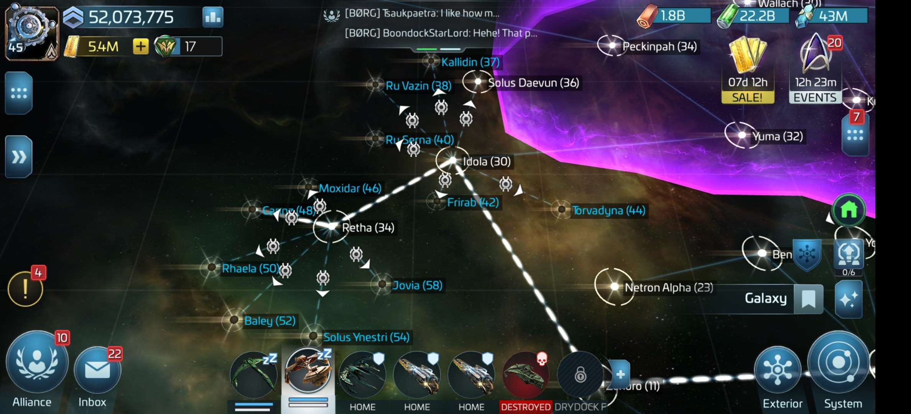
  
  
  

__Borg Solo Armadas__
- **Borg Solo Armadas** require sending 3 of your own ships to attack a Borg Sphere armada.
    - Armada targets immediately repair all hull damage after an unsuccessful attempt
- Complete 4 **Translink Disruptor** research nodes in the _Combat_ research tree to dramatically boost damage against **Borg Solo Armadas**
    - `+35000%` damage dealt with faction ships and the ISS Jellyfish
    - **Federation Translink Disruptor**
    - **Klingon Translink Disruptor**
    - **Romulan Translink Disruptor**
    - **Jellyfish Translink Disruptor**
- **Borg Solo Armadas** are typically short duration, have exceedingly high defense stats, managable piercing stats, and do not deal significant critical damage, so player ship crews should focus on maximizing their own damage mitigation and critical hits. Examples:
    - `5 of 11`, `7 of 11`, `Khan`
    - `Sisko`, `O'Brian`, `Bashir` 
    - `Picard`, `Beverly`, `Lorca`

    
   
    
  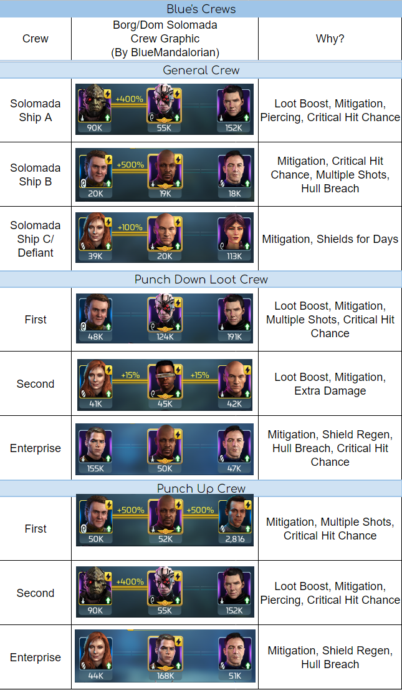
  <!-- 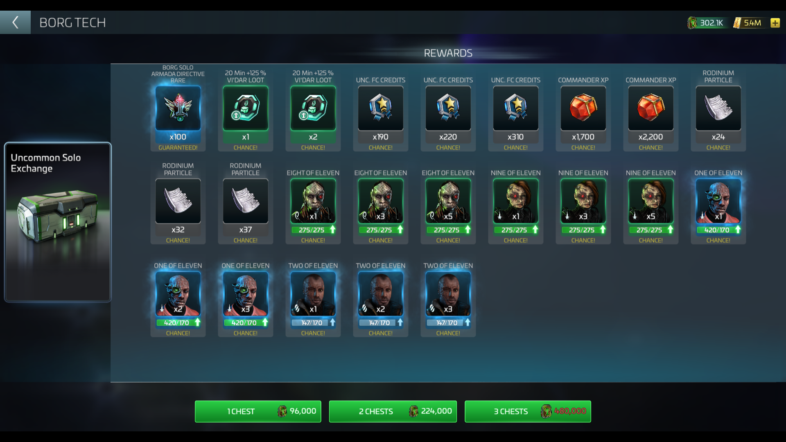
  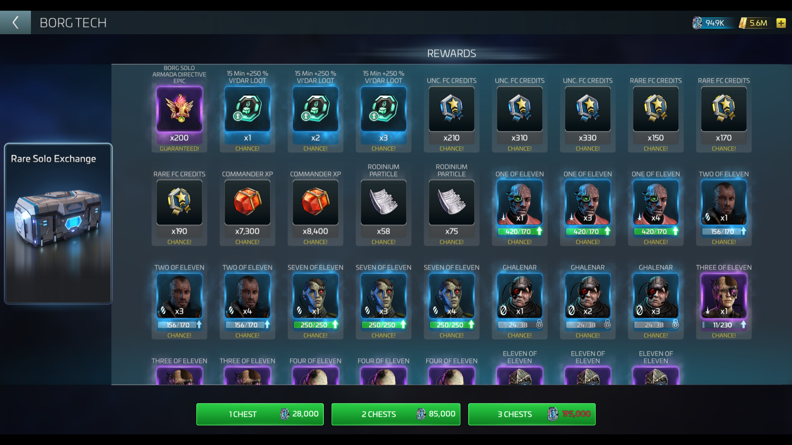
  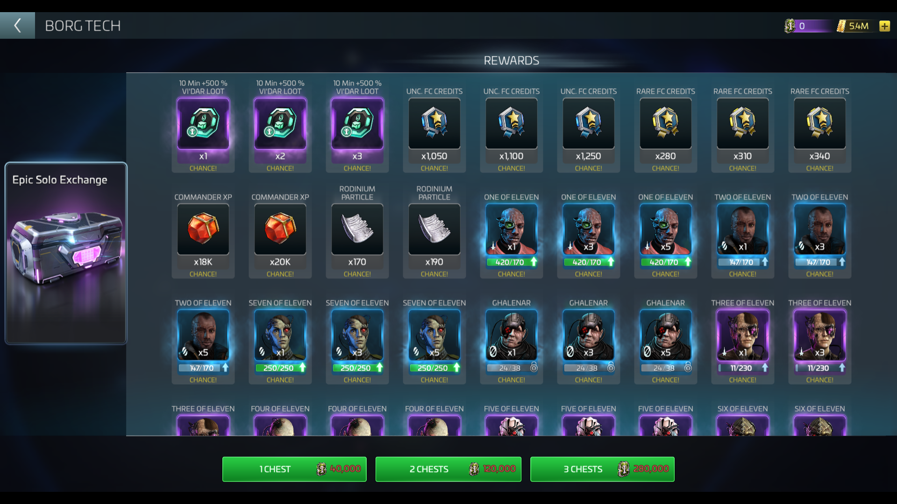 -->

__Expansion Cube Armadas__
- Requires all participants to use a **Vidar Talios** with the **Foreknowledge** buff for success:
    - Defeat any **Borg Solo Armada** to gain the **Foreknowledge** buff 
    - **Foreknowledge** buff is automatically applied to your **Vidar Talios** 
    - `1` Hour duration
- Requires coordinated crews:
    - TBD - Perhaps similar to **Megacube Armada** crews

  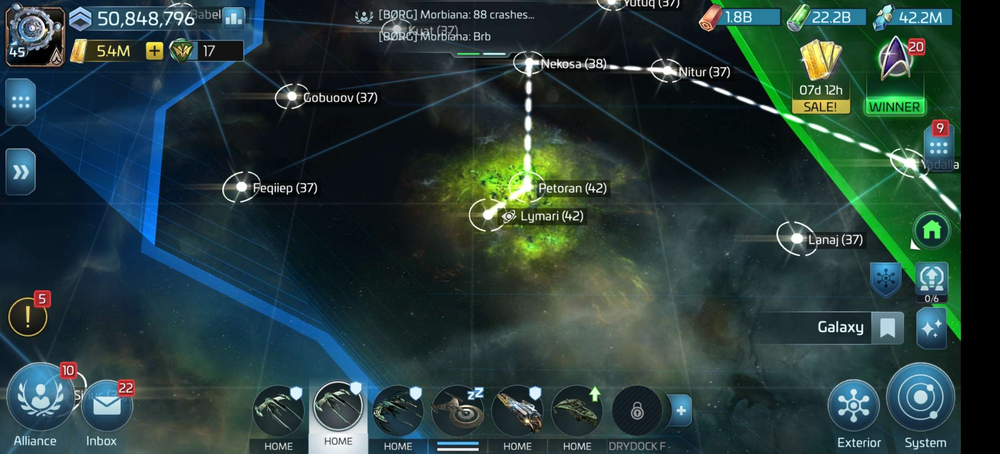
  
  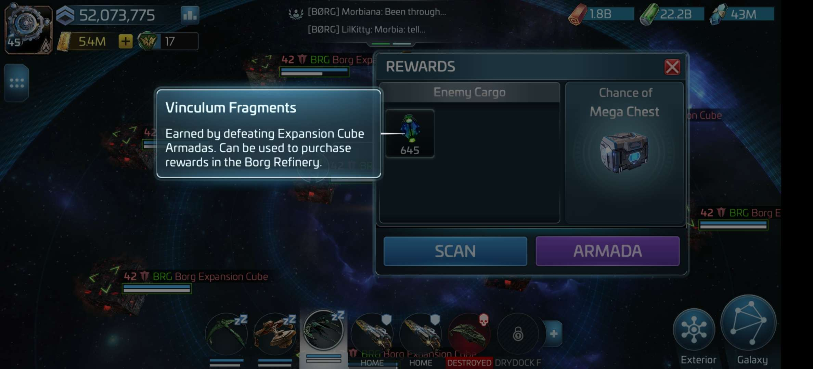 
  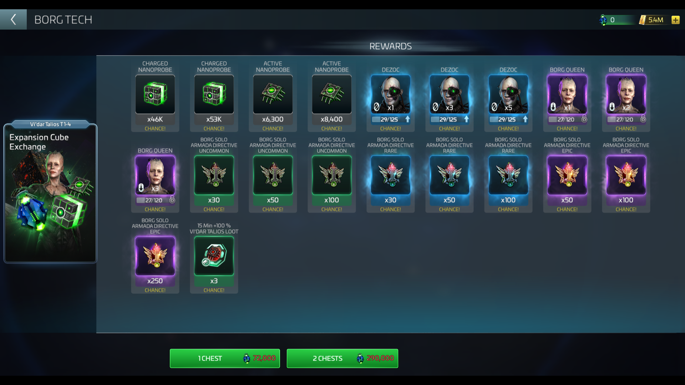

__Regular Borg Armadas__
- Only useful when required for events
    - Rewards small amount of **Active Nanoprobes**
- Spend **Borg Armada Directives** to start Uncommon/Rare/Epic **Regular Borg Armadas** in systems surrounding the **Protari System**
- All participants should use a **Vidar** or **Vidar Talios**
- At least one participant should crew using `9 of 11` with max synergy for anti-critical effect:
    - `9 of 11`, `8 of 11`, `7 of 11`

  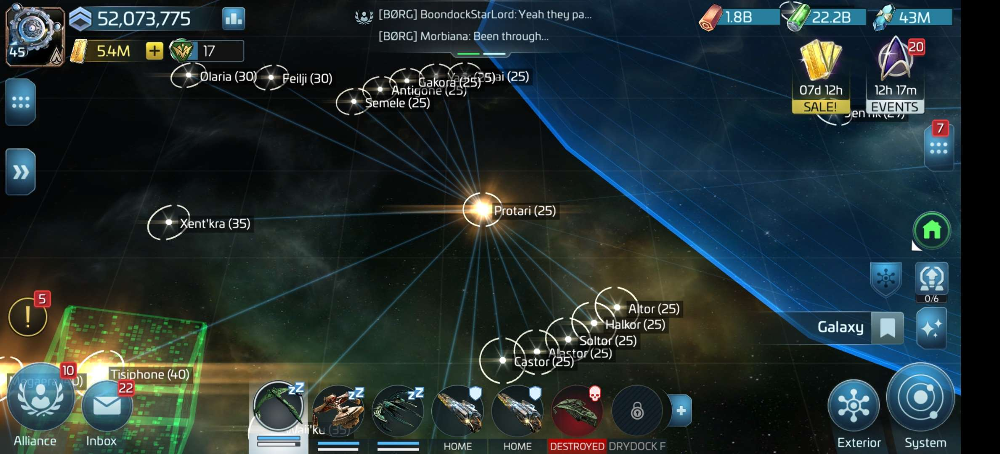
  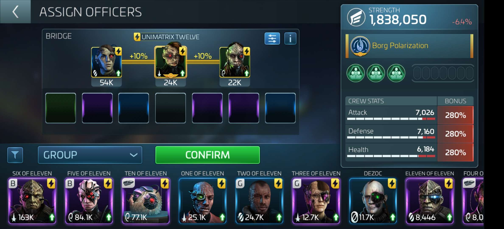

__Megacube Armadas__
- Only useful when required for events
    - Rewards small amount of **Active Nanoprobes**
- Spend **Borg Megacube Directives** to start **Megacube Armadas** in **Tisiphone**, **Megaera**, and **Alecto** systems
    - 3 Different Types corresponding with the battle triangle:
        - **Megacube Tractor Beam** = Explorer
        - **Megacube Photon Cannon** = Interceptor
        - **Megacube Disruptor** = Battleship
    - **Megacube Disruptors** are the optimal target 
- Requires all participants to use a **Vidar** or **Vidar Talios** for success
- Requires coordinated crews for success:
    - Weakest Ship (Anti-Critical) -  `9 of 11` with max synergy
    - Strongest Ship (Hull Breach) - `5 of 11`, `6 of 11`, `Lorca`
    - Other Ships (Critical) - `5 of 11`, `6 of 11`, `Khan`

  
  
  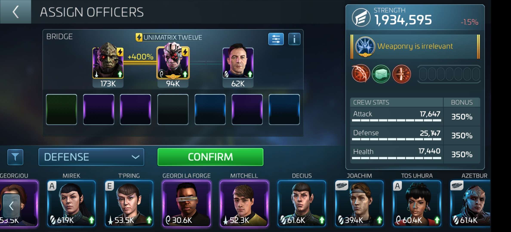
  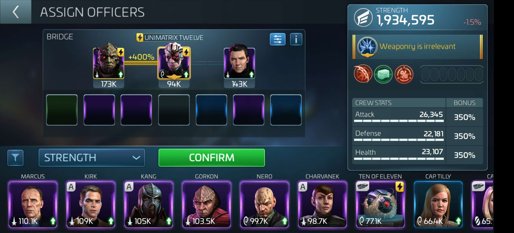

__References__
* https://www.startrekfleetcommand.com/2023/01/10/update-m50-patch-notes/
* https://www.startrekfleetcommand.com/2023/02/07/update-51-patch-notes/
* https://www.youtube.com/watch?v=Gi5ydzUlLXU
* https://www.youtube.com/watch?v=oxSNplttyNY
