__Mantis Ship Usage__
- PvP - Special active ability **Venomous Puncture** costs **Condensed Venom** to _Debuff_ player ships
    - Pull **Condensed Venom** daily from the **Mantis Refinery** for free
- PvE - Ship ability _Actian Corrupter_ `+62000%` damage against **Actian** hostiles (scales with Mantis ship level)

  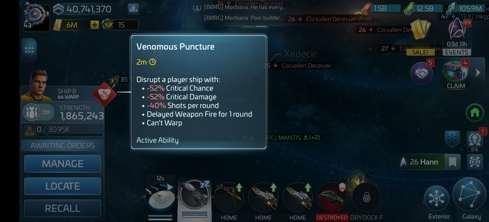
  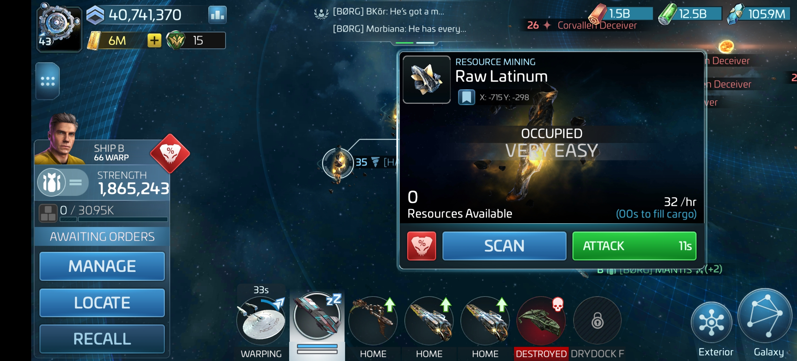
  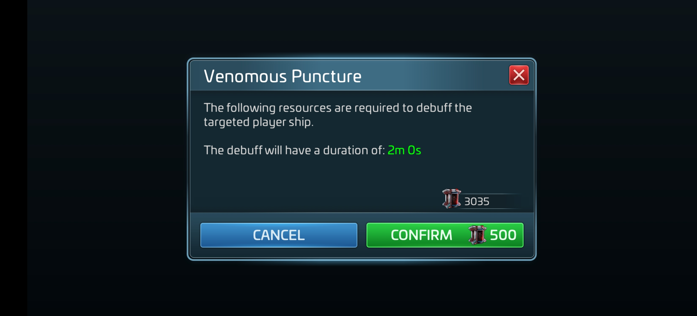

__Mantis Game Loop__
- Pull `1000` free **Condensed Venom** daily from the **Mantis Refinery** (analogous to Irvinite)
    - Used to activate Mantis's **Venomous Puncture** special ability
- Pull `3` free **Ancient Beacons** daily from the **Mantis Refinery** (analogous to Transwarp Cells)
- Use **Ancient Beacons** to enter **Actian Hostile** systems surrounding the **Donscheel System** (analogous to Borg Probe systems)
- Grind **Actian Hostiles** to collect **Actian Venom**  (analogous to Inert Nanoprobes)
- Spend **Actian Venom** in the **Mantis Refinery** to pull different resources:
    - **Synthetic Nitrium** (daily) - Mantis ship component upgrades (analogous to Ceritos Parts)
    - **Synthetic Ion** (3-day) - Mantis research in the _Starships_ research tree (analogous to Culver Particles)
    - **Syndicate XP** (3-day)
    - **Hull Fragments** (3-day) - **SNW Officer Shards** in the **Mantis Refinery** (analogous to Recruit Tokens)
    
  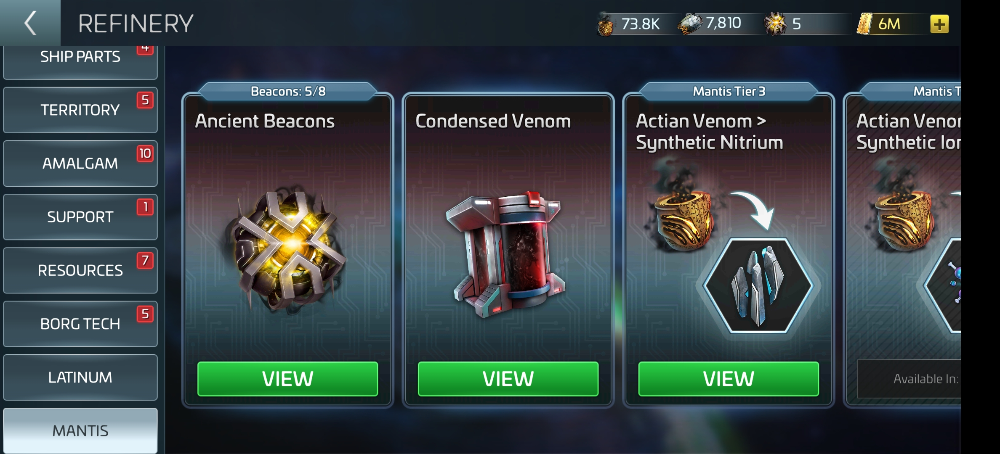
  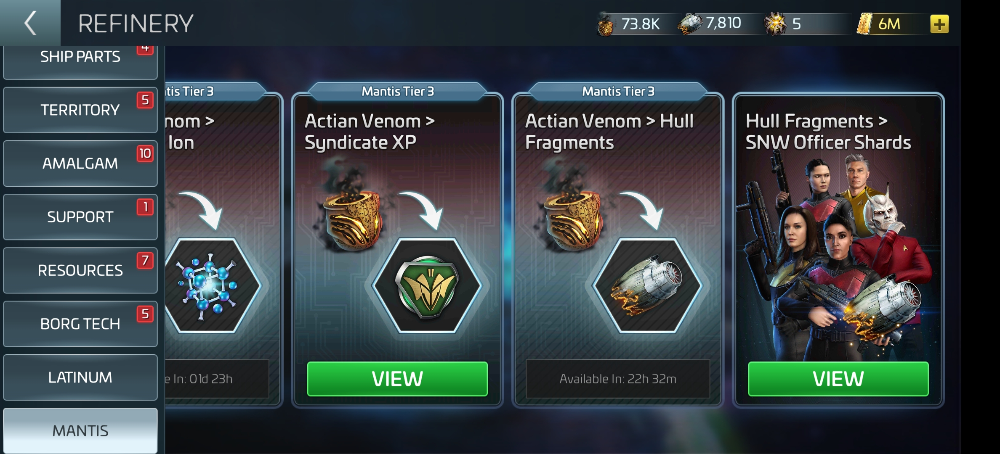
  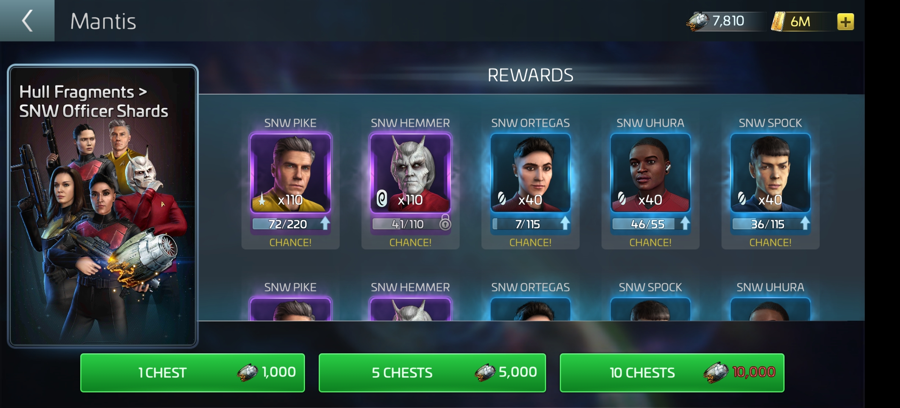

__Actian Grind__
- **Actian Chrysalis** (Explorers) Drop some **Actian Venom** but some (indicated by icons) also grant temporary (5 min) Mantis combat buffs against **Actian Hostiles** :
    - **Chrysalis Silk** - `+1` Shot per round
    - **Chrysalis Nitrium** - `+100%` Critical Chance
    - **Chrysalis Slime** - `+50%` Critical Damage
- **Actian Apex** (Interceptors) Drop ~5x more **Actian Venom** than **Actian Chrysalis's** but are uncommon and stronger
 explorers sometimes give a temporary instant buffs
- **Mantis Crew** - `SNW Pike`, `SNW Ortega`, `5 of 11`
- **Mantis Tactics** - Collect all 3 temporary buffs from **Actian Chrysalis** hostiles, then prioritize **Actian Apex** hostiles

  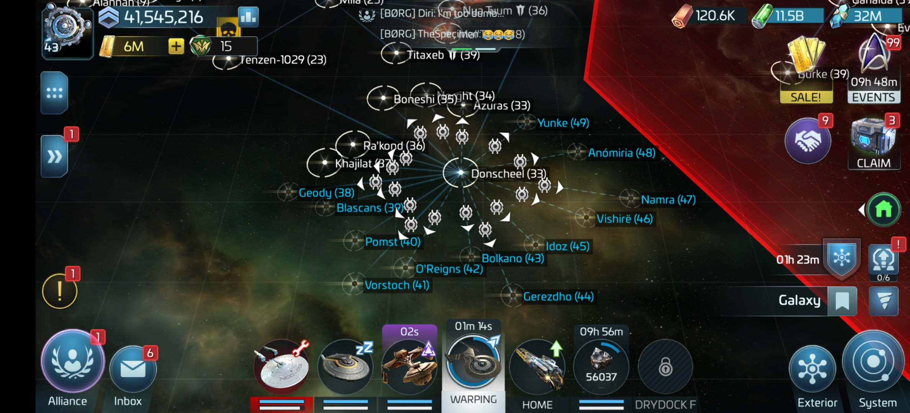
  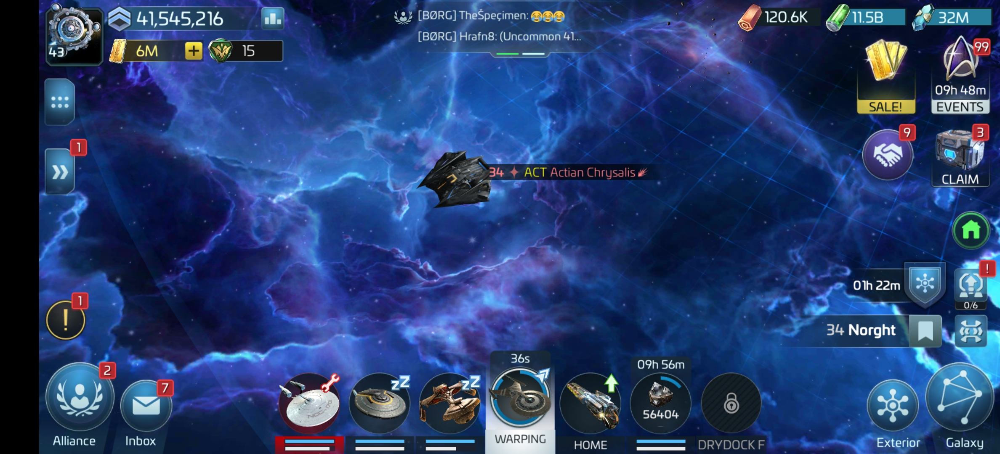
  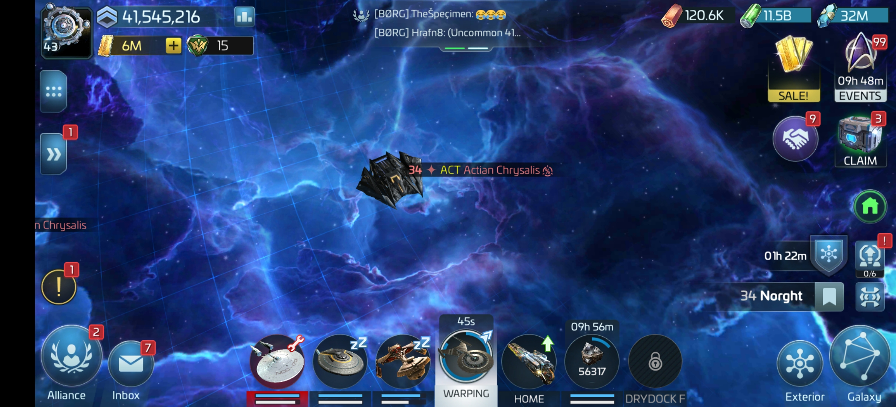
  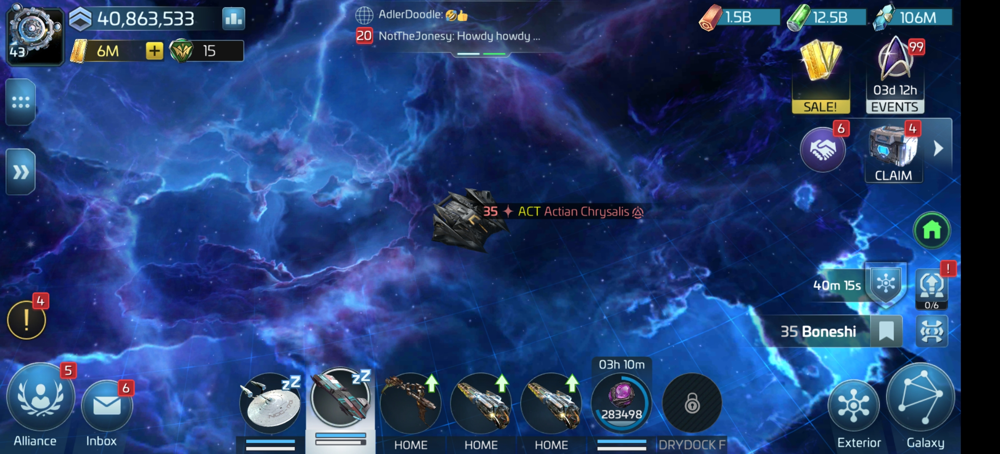
  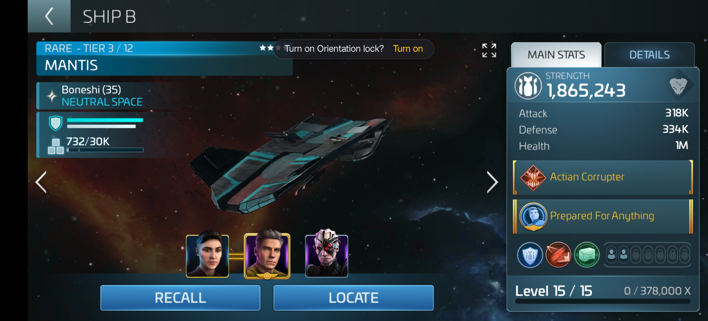

__Mantis Daily Goals__
- 2 Daily Goals reward **Hull Fragments** for using the Mantis to debuff player ships (costs **Condensed Venom**)
    - **Actian Hunter** - Debuff 2x player ships for `952` **Hull Fragments** (costs `1000` **Condensed Venom**) 
    - **Actian Slayer** - Debuff 4x player ships for `2800` **Hull Fragments** (costs `2000` **Condensed Venom**)
- Complete _both_ daily goals _every other day_ instead of only completing the basic goal every day
    - Pull `1000` **Condensed Venom** from the **Mantis Refinery** each day totaling  `2000` over 2 days
    - Gives `3000` **Hull Fragments** over 2 days instead of only `2000`

  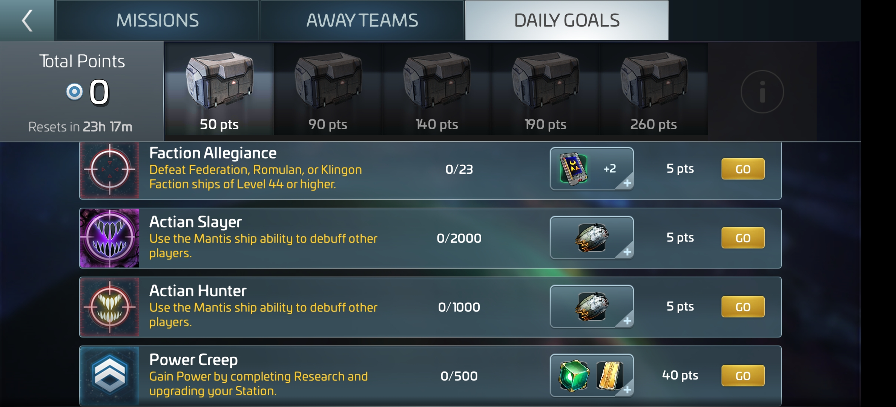

__Mantis Research__
- Spend **Synthetic Ion** from the **Mantis Refinery** on 6 Mantis Research nodes in the _Starships_ research tree:
    - Weapon Damage
    - HHP
    - SHP
    - Cargo Capacity
    - Protected Cargo
    - Impulse Speed
- 2 Mantis Prime Research nodes:
    - Improved **Synthetic Nitrium** output from the **Mantis Refinery**
    - `+100%` **Actian Venom** drops from **Actian Hostiles** with the Mantis
- Complete Level 1 of all Mantis Research nodes to receive the largest bonuses before researching higher levels.
    - Level 1 of each Mantis Research node grants a large bonus with subsequent levels granting smaller bonuses

  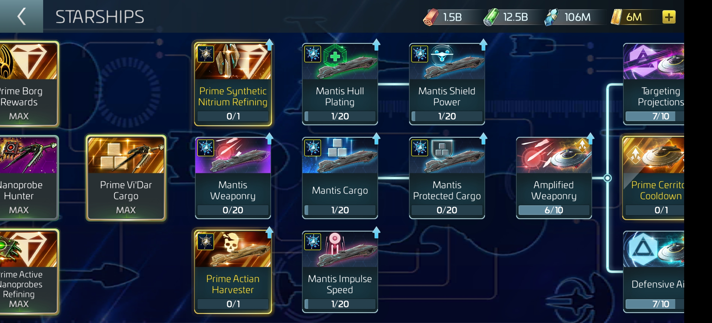

