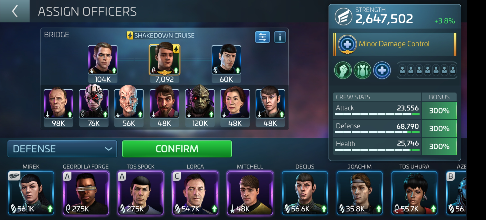

**Borg Hostile Grinding**
**Bridge Crew (Capt, Boff, Boff):** `7 of 10` , `9 of 10`, `5 of 10` (or `8 of 10`) 
**Purpose:** Borg Tactical Probe grinding
**Concept:** Maximize `7 of 10`'s captain maneuver to triple your shots per round as reliably as possible (up to `90%`)
**Comments:** 
- `7 of 10`'s captain maneuver with max synergy gives a `90%` chance to triple your shots per round for the entire combat. 
- `9 of 10` and  `5 of 10` are selected to maximize synergy for `7 of 10`. 
- `5 of 10` is preferred over `8 of 10` because `5 of 10`'s bridge officer ability increases rewards significantly (starting with `20%` at Rank 1), however `5 of 10` is difficult to obtain.

**General Hostile Grinding 1**
**Bridge Crew (Capt, Boff, Boff):** `Pike` , `Moreau`, `Chen`
**Purpose:** General hostile (reds) grinding but sub-optimal for swarms. For swarms, replace `Chen` with `T'Laan` (See swarm grinding builds below).
**Concept:** Boost `Chen`'s hostile energy damage reduction bridge officer ability as much as possible using `Pike`'s captain maneuver.
**Comments:**
- This build works very well regardless of officer ranks but will perform better with higher rank `Chen`.
- `Chen`'s bridge officer ability provides a hostile energy damage reduction (`30%` at max rank).
- `Pike`'s captain maneuver, without synergy, provides an additive (usually, sometimes multiplicative) `20%` bonus to all bridge officer abilities.
- `Moreau` gives a full synergy bonus for Pike, raising Pike's captain maneuver to a `60%` bonus. She also gives a reduction to all hostile piercing stats which is why she is preferred over any other officers in `Pike`'s synergy group.
- Assuming a max rank  `Chen`, you get a `30% + 60% = 90%` reduction to hostile energy damage.

  

**General Hostile Grinding 2**
**Bridge Crew (Capt, Boff, Boff):** `Cadet Uhura`, `Cadet Mccoy`, `Chen`
**Purpose:** General hostile (reds) grinding but sub-optimal for swarms. For swarms, replace `Chen` with `T'Laan` (See swarm grinding builds below).
**Concept:** Maximize hostile damage reduction, with a focus on hostile energy damage, using `Cadet Uhura`'s captain maneuver and `Chen`'s bridge officer ability.
** Comments:**
- This build works well regardless of officer ranks but performs better with higher ranks. 
- This build does not perform as well as `General Hostile Grinding 1`, but `Cadet Uhura` and `Cadet Mccoy` are an easier to obtain alternative to `Pike` and `Moreau`.
- `Cadet Uhura`'s captain maneuver provides a general purpose incoming damage reduction.
- `Cadet McCoy` provides both a synergy bonus for `Cadet Uhura` in addition to boosting `Cadet Uhura`'s captain maneuver due to his bridge officer ability (percentage increase for the active captain maneuver)
- `Chen`'s bridge officer ability provides a hostile energy damage reduction which stacks with `Cadet Uhura`'s general damage reduction.

  

**Swarm Hostile Grinding 1**
**Bridge Crew (Capt, Boff, Boff):** `Pike` , `Moreau`, `T'Laan`
**Purpose:** Swarm grinding and grinding hostiles that deal primarily kinetic damage.
**Concept:** Boost `T'Laan`'s hostile kinetic damage reduction bridge officer ability as much as possible using `Pike`'s captain maneuver, since swarm hostiles deal primarily kinetic damage.
**Comments:**
- This build functions identically to `General Hostile Grinding 1` but swaps out `Chen` for `T'Laan` to mitigate kinetic instead of energy damage.

  

**Swarm Hostile Grinding 2**
**Bridge Crew (Capt, Boff, Boff):** `Cadet Uhura`, `Cadet Mccoy`, `T'Laan`
**Purpose:** Swarm grinding and grinding hostiles that deal primarily kinetic damage.
**Concept:** Maximize hostile damage reduction, with a focus on hostile kinetic damage, using `Cadet Uhura`'s captain maneuver and `T'Laan`'s bridge officer ability.
**Comments:**
- This build functions identically to `General Hostile Grinding 2` but swaps out `Chen` for `T'Laan` to mitigate kinetic instead of energy damage.

**Exchange Armada (Solo)**
**Bridge Crew (Capt, Boff, Boff):** `Kirk` , `Spock`, `Gaila` 
**Purpose:** Attacking Exchange Armada targets solo or when team composition is unpredictable.
**Concept:** Maximize survivability using `Spock`'s shield heal and `Gaila`'s critical damage reduction
**Comments:** 
- This build may not work especially well with low rank (Ranks 1, 2) `Kirk` and `Spock`.
- `Kirk`'s bridge officer ability grants `Morale` while his captain maneuver boosts all officer stats, including defense, by a significant percentage while `Morale` is active.
- `Spock`'s bridge officer ability grants ship shield regeneration each round based on total officer defense as long as `Morale` is active.
- `Gaila`'s bridge officer ability reduces incoming critical damage by a significant percentage.
- Thank you *DinoDNA* for this build!

  

**Standard Morale**
**Bridge Crew (Capt, Boff, Boff):** `Kirk` , `Spock`, `Bones` 
**Lower Decks:** Maximize total crew defense 
**Purpose:** General purpose PvP and PvE
**Concept:** Enhance survivability by maximizing `Spock`'s shield restoration bridge officer ability.
**Comments:** 
- This build doesn't work well until  `Spock` reaches Rank 3 or 4 and `Kirk` reaches Rank 2 or 3.
- `Kirk`'s bridge officer ability grants `Morale` while his captain maneuver boosts all officer stats, including defense, by a significant percentage while `Morale` is active.
- `Spock`'s bridge officer ability grants ship shield regeneration each round as a percentage of total officer defense as long as `Morale` is active (`100%` at Rank 3, `400%` at Rank 4, `750%` at Rank 5).
- `Bones`'s bridge officer ability is cumulative and increases the defense of every officer on the ship by a percentage each time the ship is hit, thus improving the shield regeneration provided by `Spock`.

  

**Max Morale**
**Bridge Crew (Capt, Boff, Boff):** `McCoy` ,`Kirk` , `Spock`
**Lower Decks:** Maximize total crew defense 
**Purpose:** General purpose PvP and PvE
**Concept:** Enhance survivability by maximizing `Spock`'s shield restoration bridge officer ability.
**Comments:** 
-  Only use this configuration once both `Spock` and `McCoy` reach Rank 5.
- `McCoy`'s captain maneuver (with `Kirk` and `Spock`) improves all bridge officer abilities by `42%`, which improves `Spock`'s shield restoration to over `1000%` of the ship's total defense in addition to increasing `McCoy`'s officer defense increase per hit received to `43%`.

**Armada Critical Mitigation (Team)**
**Bridge Crew (Capt, Boff, Boff):** `Pike` , `Moreau`, `Gaila` 
**Purpose:** Attacking Armada targets as part of a coordinated team.
**Concept:** Minimize critical damage dealt by the Armada target by maximizing `Gaila`'s critical damage reduction officer ability.
**Comments:** 
- This build works well regardless of officer ranks but performs better with higher rank `Gaila`.
- `Gaila`'s bridge officer ability reduces incoming critical damage by a percentage (`10%` at Rank 1 up to `50%` at Rank 5) against hostiles and armadas. 
- `Pike`'s captain maneuver, without synergy, provides an additive (usually, sometimes multiplicative) `20%` bonus to all bridge officer abilities.
- `Moreau` gives a full synergy bonus for Pike, raising Pike's captain maneuver to a `60%` bonus.
- With Rank 1 `Gaila` you receive a `10% + 60% = 70%` reduction to incoming critical damage. With Rank 5 `Gaida` you receive a `50% + 60% = 110%` reduction to incoming critical damage.
- Note: `Gaila`'s critical damage reduction is applied by *decrementing* rather than scaling the target's `Critical Damage` percentage. For example, if the target has a `Critical Damage` value of `150%`, then a `110%` reduction by `Gaila` would result in a value of `150% - 110% = 40%`.

**Leslie Moral**
**Bridge Crew (Capt, Boff, Boff):** `Frank Leslie`, `Kirk` , `Spock` 
**Lower Decks:** Maximize total crew defense 
**Purpose:** Boosting your "single-rep max" against Armada, Hostile, or Boss targets that are larger than you can typically handle.
**Concept:** Enhance survivability using `Leslie`'s hull restoration captain maneuver while keeping shields up with `Spock`'s shield restoration bridge officer ability.
**Comments:** 
- Do not use on the Enterprise.
- This build doesn't work well until  `Spock` reaches Rank 3 or 4 and `Kirk` reaches Rank 2 or 3.
- If you win a battle due to `Leslie`'s hull restoration, then your ship will be destroyed after the victory. This is because `Leslie`'s hull restoration evaporates after the battle ends.
- `Leslie`'s captain maneuver restores `5%` hull health each round while your hull health is below `35%` of it's starting value at the beginning of combat.
- `Kirk`'s bridge officer ability grants `Morale` while his captain maneuver boosts all officer stats, including defense, by a significant percentage while `Morale` is active.
- `Spock`'s bridge officer ability grants ship shield regeneration each round as a percentage of total officer defense as long as `Morale` is active (`100%` at Rank 3, `400%` at Rank 4, `750%` at Rank 5).
- This build only works because all unmitigated incoming damage is split between shields and hull in an `80%`/`20%` ratio. If there is insufficient shield health to absorb the shield damage then the remaining shield damage is applied to the hull health. So long as your ship shields remain intact, your hull only receives `20%` of the unmitigated incoming damage.
- Even though `5%` hull restoration is a very small amount, the shield restoration from `Spock` should keep your shields intact much longer so that the `5%` hull restoration only needs to compensate for `20%` of the unmitigated incoming damage, which is itself typically a small amount compared to your ship's total hull health.

  

**Georgiou Burning**
**Bridge Crew (Capt, Boff, Boff):** `Georgiou`, `Ash Tyler` , `D'Jaoki` 
**Lower Decks:** Maximize total crew attack and health. 
**Purpose:** PvP using battleships and other resilient, low damage ships.
**Concept:** Apply constant burning to the opponent with `Georgiou` to activate cumulative bonuses to your own weapon damage and mitigation stats from `Ash Tyler` and `D'Jaoki` respectively.
**Comments:**
- This build doesn't work well with officers below Rank 2 or 3.
- `Georgiou`'s bridge officer ability has high chance (`50%` at Rank 1) to apply burning to the opposing player's ship while her captain maneuver decreases the attack stat of all officers on the opposing player's ship by `100%`.
- `Ash Tyler`'s bridge officer ability grants a cumulative bonus to your own ship's weapon damage as a percentage of your ship's total officer attack stats while the opposing ship is burning.
- `D'Jaoki`'s bridge officer ability cumulatively increases your own ships mitigation stats as a significant percentage of your total officer health stat (`250%` at Rank 3) while the opposing ship is burning.
- `Ash Tyler` not only provides a synergy bonus to `Georgiou` but also works better on low weapon damage ships as compared to `Decius` (another common damage boosting officer) since `Ash Tyler`'s bonus value is independent of your ship's base weapon damage and thus does not scale down with low base weapon damage as `Decius`'s bonus does.

  

**3* Gas Mining**
**Bridge Crew (Capt, Boff, Boff):** `T'Pring`, `10 of 10` (or `Domitia`/`Barot`), `Stonn` (or `K'Bisch`/`Makinen`) 
**Lower Decks:** Any
**Purpose:** Maximize 3* Gas mining rate 
**Concept:** Maximize your 3* Gas mining rate bonuses by optimizing synergy for `T'Pring` and using `10 of 10`'s officer ability if available.
**Comments:**
- Higher rank `10/10` will work better but any rank will work well.
- `10 of 10` is the preferred bridge officer as its officer ability grants a general mining speed bonus of at least `80%`, which greatly exceeds the `35%` synergy bonus another officer could give `T'Pring`.

**3* Ore Mining**
**Bridge Crew (Capt, Boff, Boff):** `Stonn`, `10 of 10` (or `Barot`/`Domitia`), `T'Pring`/`Dupont` (or `Helvia`) 
**Lower Decks:** Any
**Purpose:** Maximize 3* Ore mining rate 
**Concept:** Maximize your 3* Ore mining bonuses by optimizing synergy with `Stonn` and using `10 of 10`'s officer ability if available.
**Comments:**
- Higher rank `10/10` and `T'Pring`/`Dupont` will work better but any rank will work well.
- `10 of 10` is the preferred bridge officer as its officer ability grants a general mining speed bonus of at least `80%`, which greatly exceeds the `35%` synergy bonus another officer could give `Stonn`.
- `T'Pring`/`Dupont` are preferred over other officers in `Stonn`'s synergy group because their officer abilities grant the same bonus protected cargo which allows you to safely mine more materials in a single trip.

**3* Crystal Mining**
**Bridge Crew (Capt, Boff, Boff):** `Barot`, `10 of 10` (or `Stonn`/`K'Bisch`/`Makinen`), `T'Pring`/`Dupont` (or `Helvia`) 
**Lower Decks:** Any
**Purpose:** Maximize 3* Crystal mining rate 
**Concept:** Maximize your 3* Crystal mining bonuses by optimizing synergy with `Barot` and using `10 of 10`'s officer ability if available.
**Comments:**
- Higher rank `10/10` and `T'Pring`/`Dupont` will work better but any rank will work well.
- `10 of 10` is the preferred bridge officer as its officer ability grants a general mining speed bonus of at least `80%`, which greatly exceeds the `35%` synergy bonus another officer could give `Barot`.
- `T'Pring`/`Dupont` are preferred over other officers in `Barot`'s synergy group because their officer abilities grant the same bonus protected cargo which allows you to safely mine more materials in a single trip.

**Basic Parasteel Mining**
**Bridge Crew (Capt, Boff, Boff):** `Helvia`, `T'Pring`/`Dupont`, `Stonn`/`K'Bisch`/`Makinen`
**Lower Decks:** Any
**Purpose:** Boost Parasteel mining rate and protected cargo
**Concept:** Boost Parasteel mining bonuses using synergy for `Helvia` while boosting protected cargo with `T'Pring`/`Dupont`.
**Comments:**
- Higher rank `T'Pring`/`Dupont` will work better but any rank will work well.
- `T'Pring`/`Dupont` are preferred over other officers in `Helvia`'s synergy group because their officer abilities grant the same bonus protected cargo which allows you to safely mine more RSS in a single trip.

**Basic Tritanium Mining**
**Bridge Crew (Capt, Boff, Boff):** `K'Birsch`, `T'Pring`/`Dupont`, `Barot`/`Domitia`
**Lower Decks:** Any
**Purpose:** Boost Parasteel mining rate and protected cargo
**Concept:** Boost Parasteel mining bonuses using synergy for `K'Birsch` while boosting protected cargo with `T'Pring`/`Dupont`.
**Comments:**
- Higher rank `T'Pring`/`Dupont` will work better but any rank will work well.
- `T'Pring`/`Dupont` are preferred over other officers in `K'Birsch`'s synergy group because their officer abilities grant the same bonus protected cargo which allows you to safely mine more RSS in a single trip.

**Basic Dilithium Mining**
**Bridge Crew (Capt, Boff, Boff):** `Domitia`, `T'Pring`/`Dupont`, `Stonn`/`K'Bisch`/`Makinen`
**Lower Decks:** Any
**Purpose:** Boost Dilithium mining rate and protected cargo
**Concept:** Boost Dilithium mining bonuses using synergy for `Domitia` while boosting protected cargo with `T'Pring`/`Dupont`.
**Comments:**
- Higher rank `T'Pring`/`Dupont` will work better but any rank will work well.
- `T'Pring`/`Dupont` are preferred over other officers in `Domitia`'s synergy group because their officer abilities grant the same bonus protected cargo which allows you to safely mine more RSS in a single trip.

**Fast RSS Mining**
**Bridge Crew (Capt, Boff, Boff):** `10 of 10`, `9 of 10`/`1 of 10`/`7 of 10`/`6 of 10` (or `8 of 10`/`5 of 10`), `T'Pring`/`Dupont`
**Lower Decks:** Any
**Purpose:** Boost all RSS mining rates and protected cargo
**Concept:** Use `10 of 10` to boost all RSS mining rates with synergy bonuses while boosting protected cargo with `T'Pring`/`Dupont`.
**Comments:**
- Higher rank `10 of 10` and `T'Pring`/`Dupont` will work better but any rank will work well.
- `9 of 10`/`1 of 10`/`7 of 10`/`6 of 10` are preferred due to their full `75%` synergy bonus for `10 of 10`, while `8 of 10` and `5 of 10` are sub-optimal due to their weak `25%` synergy bonus for `10 of 10`.

